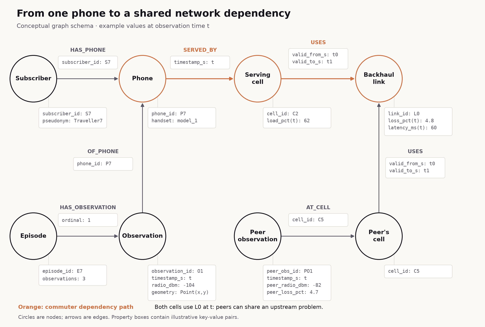
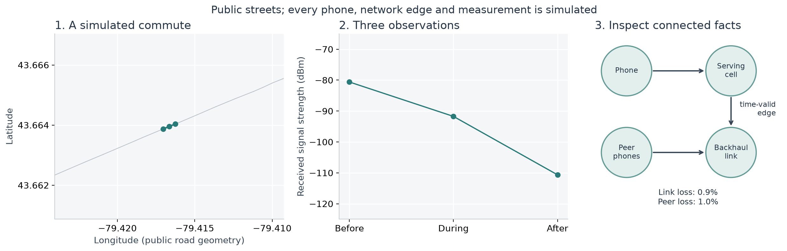
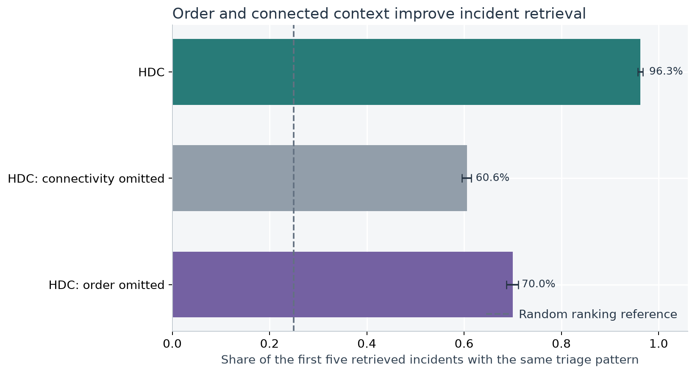
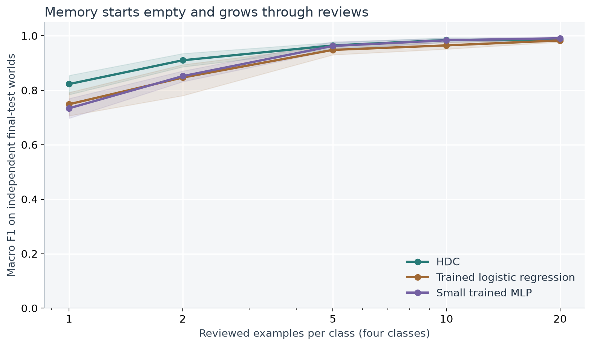
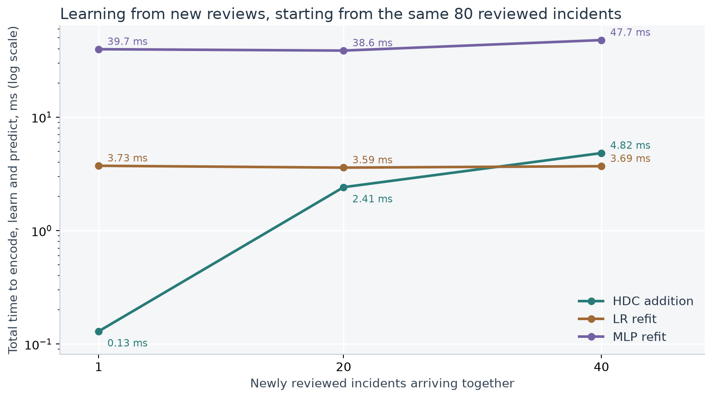

# Hyperdimensional Computing for Telecom Incident Triage

*An experimental study of composable representations, retrieval with provenance, and incremental learning*

## The operational problem

Telecom service assurance concerns the quality of the calls and data sessions customers use. When service degrades, an operations team needs to decide where to investigate first and how widely the problem may extend. A symptom affecting one subscriber might involve the phone's radio connection; similar symptoms across several subscribers might involve a shared network dependency. This first assessment is **incident triage**. It guides investigation before a cause is confirmed.

The evidence spans several kinds of data: subscriber and handset records, measurements over time, network telemetry, locations, and the relationships between network components. A useful comparison must connect those records. The same measurement can mean different things depending on which component produced it, which other components depend on it, and whether service is worsening or recovering.

Earlier incidents offer a practical starting point. A triage tool can bring comparable cases to an engineer's attention, show the observations and network facts supporting the comparison, and incorporate the outcomes of reviewed cases into future decisions. This creates a combined data-engineering and learning problem: preserve the meaning of connected, changing evidence while maintaining a memory that can grow as reviews arrive.

## Scope and research questions

We narrow that broader use case to one question:

> A commuter's call drops. Which earlier incidents resemble it, what network facts support that comparison, and how can reviewed incidents improve future triage?

The study evaluates two tasks: retrieving comparable earlier incidents, and assigning a triage pattern using previously reviewed examples. Each incident includes a short sequence of phone measurements and the network context connected to that phone at those times. Triage happens after the full observation window, so the available evidence can include deterioration or recovery.

**Hyperdimensional computing (HDC)** represents these facts in long numeric arrays called hypervectors. Its operations can attach a value to a role, combine contributions, and preserve order. We study whether an episode built with those operations can support retrieval, inspection of its source evidence, and learning through additions to labelled class memory while the encoder stays fixed.

The experiments examine four questions:

- **Representation:** Do roles, event order and network connectivity change the meaning of an encoded incident?
- **Retrieval and evidence:** Can it find comparable earlier incidents and return the source records supporting the comparison?
- **Learning:** How many reviewed incidents does each method need to classify new incidents well?
- **Resources:** How long do prediction and learning from new reviews take, and how much storage does each representation need?

The learning and cost experiments compare HDC with regularized logistic regression (LR) and a small MLP, all given the same reviewed incidents and connected measurements. Retrieval evaluates HDC on its own, removing order and connectivity as internal checks.

## Key findings

**Where HDC adds value**

- **Learns from very few reviews.** With 1 review per class, HDC scores 7.4–8.9 points higher macro F1 than LR and the MLP.
- **Learning from a new review costs almost nothing, and the cost does not grow.**
  - **HDC:** 0.130 ms to add a reviewed incident to memory: one vector addition, however many reviews came before.
  - **LR and the MLP:** 3.726 ms and 39.7 ms to retrain on all retained reviews, every update.
  - **Retraining slows as reviews accumulate:** in our initial fits, from 1.92 to 3.55 ms for LR and from 10 to 37 ms for the MLP, between 4 and 80 reviews.
  - **No retained history:** HDC needs no earlier reviews kept, and every update can be undone exactly.
- **Finds comparable incidents and shows why.** Retrieval reaches 96.3% precision@5, against 25.0% for random ranking. Every similarity score breaks down exactly into contributions from individual facts, each traceable to its source records.
- **One representation, many uses.** The same hypervector serves retrieval, classification, explanation and editing; a fact such as the handset can be removed from a query without re-encoding the rest.

**Tradeoffs and limits**

- **More storage.** Each incident needs 16,384 bytes as a hypervector, about 195× the 84 bytes of its raw measurements.
- **On par, not ahead, once reviews accumulate.** From 5 reviews per class, the three methods are within 2.0 points of one another.
- **The class memory doesn't learn which facts matter.**
  - It is a running sum of reviewed incidents, so each fact keeps the fixed weight the encoder gave it. LR and the MLP learn a weight for each input from the labels.
  - A pattern decided by a few facts can be outvoted by facts that vary.
  - This concerns the class memory used here, not HDC encoding; see [Future work](#future-work-teaching-the-class-memory-which-facts-matter).

## The dataset

We use a controlled simulation with a recognizable geographic setting: a commute corridor along Bloor Street West in Toronto. Public street geometry supplies the map. Every subscriber, handset, trajectory, network component, measurement and review is simulated. This lets us vary roles, chronology and connectivity deliberately, and check results against retained source records. It does not establish performance on a carrier's operational data.

### Just enough telecom to read the example

A **subscriber** is the simulated customer; a **handset** is their phone. **Radio** means the wireless part of its connection. The **serving cell** provides that phone's cellular connection at the observation time, through base-station equipment. A **backhaul link** carries traffic from the cell into the rest of the operator's network. The simplified path is **phone → serving cell → backhaul link**. Other phones can use different cells but share that link; we call them **peer phones**. This [radio/transport distinction](https://www.ericsson.com/en/public-policy-and-government-affairs/5-key-facts-about-5g-radio-access-networks) is what makes connected evidence useful.

| Measurement | What it tells us |
|---|---|
| Received signal strength, in dBm | How much cellular signal power reaches the phone. **−80 dBm is stronger than −90 dBm.** |
| Cell load, in % | How busy the serving cell is; a simulated utilization indicator in this study. |
| Packet loss, in % | The share of data packets that fail to arrive. A packet is a small chunk of transmitted data; 1% loss means about one in 100 is missing. |
| Latency, in ms | How long data takes to travel over the link. One millisecond is 0.001 seconds. |
| Peer averages | Mean signal-strength and loss measurements from phones sharing the same backhaul link at the same time. |

**dBm** expresses power on a logarithmic scale relative to one milliwatt. Negative values mean power below that reference, not negative power. A 10 dB decrease means ten times less power. We simulate a generic received-power measurement; signal strength alone does not determine call quality. [Unit reference](https://scdn.rohde-schwarz.com/ur/pws/dl_downloads/dl_application/application_notes/1sl378/1SL378_0e_ColdSrcNF.pdf).

### The connected records

[Open the schema at full size](figures/schema.svg) or [in a browser](figures/schema.html). Circles are nodes; directed arrows are relationships reconstructed from record IDs. The property values are illustrative. The phone → cell relationship comes from its observation at time $t$; cell → link edges are valid when $t_0 ≤ t < t_1$. Cell load and link measurements marked **(t)** are joined telemetry at that time, rather than static component properties. Peer observations are separate source records; they need not identify individual peer subscribers.

Each simulated network/time block contains six cells and two backhaul links with one consistent **telemetry** timeline: measurements describing their state over time. Phones using the same component at the same time see the same infrastructure state. The cell-to-link edges change halfway through the block, with recorded validity intervals. Subscriber identities connect records; they do not determine similarity.

The unit of analysis is an **episode**: three observations at 0, 20 and 40 seconds, before, during and after a disruption or a normal-service reference window. Four balanced patterns define the evaluation classes:

| Pattern | What the observations show |
|---|---|
| Deteriorating radio | The phone's received signal becomes weaker across the episode. |
| Transient recovery | The phone's received signal improves by the end of the episode. |
| Shared transport impairment | The shared backhaul link and peer phones show packet loss; the phone's own signal profile can vary. |
| Normal service | Neither a large signal change nor the shared backhaul impairment occurs. |

An independent checker reconstructs these labels from source measurements, event order and valid edges. Encoder input does not include generator scenario names, labels or service-disruption outcomes. Review labels become available 300 seconds after the complete episode; they stand in for analyst feedback in the demonstration. No human reviews were collected.

Each data seed produces 2,400 episodes across 24 independent network/time blocks. Of those blocks, 12 build labelled memory, 6 support model selection, and 6 are reserved for final testing. Subscribers and shared incidents stay within their assigned block. No validation or final-test label updates memory.

The full experiment crosses 5 data seeds with 3 encoder seeds. It scores 9,000 final queries across repetitions, representing 30 distinct final-test worlds. Repeated encoders reuse episodes and are averaged before uncertainty intervals resample data seeds and complete worlds. Those intervals describe this generator.

The street snapshot contains 99 Bloor Street segments, with frozen source checksums and longitude/latitude coordinates (EPSG:4326). No distances are computed from angular coordinates, and the simulation does not predict signal strength from the street geometry. Contains information licensed under the Open Government Licence – Toronto. [Dataset](https://ckan0.cf.opendata.inter.prod-toronto.ca/en/dataset/toronto-centreline-tcl); [licence](https://www.toronto.ca/city-government/data-research-maps/open-data/open-data-licence/).

## Start with one incident

Consider a simulated commuter travelling along Bloor Street West. In this walkthrough, the phone's received signal strength changes from -80.6 dBm before the disruption to -110.6 dBm afterwards. At the middle observation, the connected backhaul link reports 0.9% packet loss, and peer phones using that dependency report 1.0% mean loss.

The task is to find earlier episodes with a similar signal trajectory and network conditions, then show the engineer what they have in common.

The query is **S1006-W18-E00-0**, whose independently reconstructed pattern is **deteriorating radio**. Its first retrieved comparison is **S1006-W08-E09-3**, labelled **deteriorating radio**. The walkthrough uses the first final-test episode with an observed service disruption, selected before inspecting retrieval correctness. It illustrates the workflow; the experiments below evaluate all final-test queries.

A retrieved comparison is a lead for the engineer to inspect, not a confirmed cause of the dropped call.

## How the encoder is built

The encoder turns an episode into one **4,096-dimensional hypervector**. Think of it as an additive description: a measurement contributes according to what it measures, where it sits in the dependency path, and when it occurs.

### 1. Resolve the facts before encoding

At each of three observations, exact temporal joins follow the phone's serving cell and that cell's valid backhaul edge. They supply six numeric facts. The table names the source of each fact so that “context” means a specific network relationship:

| Source at the observation time | Measurement | Physical range used for encoding |
|---|---|---|
| The commuter's phone | Received cellular signal strength | −125 to −65 dBm |
| The cell serving that phone | Cell load | 0–100% |
| The backhaul link used by that cell | Packet loss | 0–10% |
| The same backhaul link | Latency | 0–120 ms |
| Peer phones sharing that backhaul link | Mean received signal strength | −125 to −65 dBm |
| The same peer phones | Mean packet loss | 0–10% |

The **phone signal channel** contains the commuter phone's own signal measurement. The **connected-context channel** contains the other five measurements: cell load, backhaul loss and latency, and the two peer averages, all joined through the active dependency at the same time. Three observation times produce three phone signal facts and fifteen context facts per episode. The phone's handset model is a separate, small categorical contribution.

The graph chooses which source measurements enter the representation. The encoder binds **typed roles**, such as phone → serving cell → backhaul; it does not bind subscriber, cell or link identifiers. Two unrelated subscribers can therefore resemble each other when their measurements and connected context match. Changing an edge can change the joined facts even when the full network contains the same measurements.

### 2. Make nearby numbers similar

For a measurement $x$ with physical range $[a_f,b_f]$, first map it to a clipped fraction, then to one of 32 numeric levels:

$$
s_f(x)=\mathrm{clip}\!\left(\frac{x-a_f}{b_f-a_f},0,1\right),
\qquad q_f(x)=\mathrm{round}\!\left((K-1)s_f(x)\right).
$$

TorchHD supplies a seeded family of correlated level hypervectors $\ell_0,\ldots,\ell_{K-1}$. Adjacent levels overlap more than distant levels. For example, −90 and −92 dBm receive nearby representations, while −90 and −115 receive more distinct ones. The ranges are fixed physical bounds, not statistics fitted to validation or test data. Values outside them are clipped; rounding introduces finite numeric resolution.

The same level family serves every numeric field. Binding each value to its attribute role distinguishes radio strength from packet loss, even if their scaled fractions coincide.

### 3. Bind the value to its meaning and connected role

We use $\otimes$ for **binding**, $\oplus$ for **bundling**, and $\rho$ for **permutation**. Here binding multiplies corresponding coordinates, bundling adds corresponding coordinates without thresholding, and $\rho^j(v)$ rotates the coordinates of $v$ by $j$ positions. The repeated-bundling symbol $\bigoplus$ combines several hypervectors. Atomic roles and channel markers are seeded bipolar arrays containing +1 and −1.

For the commuter phone's signal strength, the role product is:

$$
P_{\mathrm{radio}}=r_{\mathrm{phone}}\otimes r_{\mathrm{radio}}.
$$

For packet loss on the connected link, it includes the ordered dependency roles:

$$
P_{\mathrm{loss}}=
r_{\mathrm{phone}}
\otimes\rho^1\!\left(r_{\mathrm{serves}}\right)
\otimes\rho^2\!\left(r_{\mathrm{cell}}\right)
\otimes\rho^3\!\left(r_{\mathrm{uses}}\right)
\otimes\rho^4\!\left(r_{\mathrm{backhaul}}\right)
\otimes\rho^4\!\left(r_{\mathrm{loss}}\right).
$$

The rotations mark positions along the typed path. Peer facts extend it with shared-dependency and peer-phone roles. This role product specifies the meaning of the joined measurement; source identities remain in the accompanying manifest for provenance.

### 4. Preserve observation order, then bundle the channels

For observation position $p\in\{0,1,2\}$ and field $f$, the unweighted contribution is:

$$
e_{p,f}=\rho^{p+1}\!\left(c_{\mathrm{channel}(f)}\otimes P_f\otimes\ell_{q_f(x_{p,f})}\right).
$$

The outer rotation marks **before, during or after**. It is separate from the rotations marking path roles. Moving a radio measurement from before the disruption to after it changes its contribution, allowing deterioration and recovery to remain distinguishable.

Bundling adds these contributions. Define the phone signal channel $S$ and context channel $C$ as:

$$
S=\frac{1}{\sqrt{3}}\bigoplus_{p=0}^{2}e_{p,\mathrm{radio}},
\qquad
C=\frac{1}{\sqrt{15}}\bigoplus_{p=0}^{2}\bigoplus_{f\in\mathcal F_C}e_{p,f}.
$$

The square-root divisors account for the different numbers of terms; they do not force every episode's channel norm to be equal. If $H$ is the handset-category hypervector bound to its attribute and channel roles, the raw episode accumulator is:

$$
z=(w_S S)\oplus(w_C C)\oplus(w_H H),
\qquad (w_S,w_C,w_H)=(1.0,2.0,0.25).
$$

**“Context weight” means $w_C$, the multiplier of the bundled connected-context channel $C$ before normalization.** With the active defaults, the complete equation is:

$$
z=\frac{1}{\sqrt{3}}\bigoplus_{p=0}^{2}e_{p,\mathrm{radio}}
 \oplus\frac{2}{\sqrt{15}}\bigoplus_{p=0}^{2}\bigoplus_{f\in\mathcal F_C}e_{p,f}
 \oplus0.25H.
$$

Each radio fact therefore has raw coefficient $1/\sqrt{3}\approx0.577$, while each network-context fact has $2/\sqrt{15}\approx0.516$. The channel multiplier is two, but each context fact does not receive twice the coefficient of a radio fact: the channel contains more terms.

**Why give connected context more weight?** A shared transport incident can accompany weak, recovering or normal phone radio. Its common evidence lies upstream. Weight 2.0 was chosen in the earlier validation diagnosis and frozen before this fresh evaluation. It keeps the network evidence from being overwhelmed by the varying radio profile. It is a modelling choice for this study, not a universal HDC constant.

Weights act on raw contributions before normalization, so they do not reserve a fixed share of similarity for either channel.

### 5. Use the same accumulator for retrieval, editing and learning

All arithmetic above uses float32 and retains the unthresholded bundle. Only then normalize:

$$
\hat z=\frac{z}{\lVert z\rVert_2},
\qquad \mathrm{similarity}(q,x)=\hat z_q^\mathsf{T}\hat z_x.
$$

Retrieval first applies exact spatial/time eligibility, then ranks eligible earlier episodes by similarity. Search storage uses float16; computation returns to float32 and the stored-vector residual is checked separately.

Because the raw bundle is retained, removing the handset means $z'=z\oplus(-w_HH)$, followed by normalization. The acceptance checks compare this edit with a complete rebuild.

A reviewed incident labelled $y$ updates a class accumulator by addition:

$$
A_y\leftarrow A_y\oplus\hat z,
\qquad \mathrm{score}_y(q)=\hat z_q^\mathsf{T}\frac{A_y}{\lVert A_y\rVert_2}.
$$

This is an **additive cosine class-memory classifier**: one accumulator per class, containing the sum of normalized hypervectors from that class's reviewed incidents. Prediction chooses the available class whose normalized accumulator has the highest cosine similarity to the query. This accumulated vector is sometimes called a prototype; the encoder stays fixed while it grows. Unseen classes are excluded from prediction; before any reviews, the system reports insufficient labelled memory. Updates retain an audit record and support exact reversal.

For an inspected candidate with weighted terms $t_j$, the retained manifest also permits exact arithmetic attribution:

$$
z_x=\bigoplus_{j=1}^{m} t_j,
\qquad a_j=\frac{\hat z_q^\mathsf{T}t_j}{\lVert z_x\rVert_2},
\qquad \mathrm{similarity}(q,x)=a_1+\cdots+a_m.
$$

The $t_j$ are hypervector contributions, combined by bundling; each $a_j$ is a scalar contribution to the cosine score. Each contribution links back to source observations, telemetry and valid edges. They explain how the score was assembled, including interference between terms, not what caused the dropped call.

## Experiment 1: what do the operators preserve?

**Question.** Can the representation tell apart the same measurements attached to different meanings, appearing in a different order, or reached through a different network connection?

**Setup.** HDC needs only three operations: `bind(role, value)` keeps a measurement attached to its meaning, `bundle(facts)` combines contributions, and `permute(observation, position)` marks order. Learning reuses addition: `class_memory += normalize(episode_vector)`. Each test below builds two episodes that differ in exactly one way and compares their 4,096-dimensional hypervectors. A control repeats the test with the relevant operator removed. Cosine similarity of 1 means the two encodings are identical; lower values mean the representation tells them apart.

| What differs between the two episodes | Operator under test | Cosine with the operator | Without the operator |
|---|---|---:|---|
| Good and bad states swap between the phone's radio and an upstream link | Binding | 0.039 | Identical encodings (max difference 0) |
| The same three observations, in reverse order | Permutation | 0.901 | Identical encodings (max difference 9.5e-07) |
| The same network measurements, with one serving edge rewired | Graph-joined context | 0.942 | Identical encodings (max difference 0) |

Numeric levels behave as intended too: adjacent levels have cosine 0.962, while distant levels have 0.018, so nearby measurements receive similar encodings.

**Interpretation.** Each operator carries exactly the information it is meant to, and without it the distinction disappears entirely. Experiment 2 shows that these distinctions matter for retrieval. The pairs are controlled design checks, not a benchmark.

**Editing a query.** Because an episode is a sum of contributions, one fact can be removed by subtraction, with no need to re-encode the others. Removing the handset from the walkthrough query matches a complete re-encoding to within 1.2e-07. After the edit, 3 of the original top five results remain in the top five. A changed ranking answers the edited question; it is not automatically a better result.

## Experiment 2: can it retrieve useful earlier incidents, and explain them?

**Question.** Does HDC return earlier incidents with the same independently checked triage pattern, and can each result be traced to its source evidence?

**Setup.** For each final-test query, exact corridor and time filters first select the eligible earlier incidents in memory: 79–420 per query in the first run (mean 319.3). Lance and an independently registered GeoDataFusion query agree on that selection. HDC then ranks the candidates by cosine similarity. A result counts as relevant when it has the query's triage pattern, which is not necessarily the same real-world cause.

| Method | Precision@5, 95% interval | Top-1 match | Reciprocal rank@10 |
|---|---:|---:|---:|
| HDC | 96.3% [95.7%, 96.7%] | 98.5% | 0.991 |
| HDC: connectivity omitted | 60.6% [59.6%, 61.5%] | 62.5% | 0.763 |
| HDC: order omitted | 70.0% [68.7%, 71.1%] | 73.3% | 0.836 |
| HDC in Lance (float16) | 96.3% [95.7%, 96.7%] | 98.5% | 0.991 |

**Result.** HDC's first result has the query's pattern for 98.5% of queries, and 96.3% of its top five do, against 25.0% expected from random ranking. Storing the search vectors in float16 halves their size with no measurable loss: precision@5 changes by 0.000 points.

**What order and connectivity contribute.** Removing the connected network context lowers precision@5 by 35.7 points [34.6, 36.8]; removing observation order lowers it by 26.2 points [25.3, 27.4]. These patterns are defined by how signal changes over time and by shared network dependencies, so large drops are expected. The ablations confirm that the encoder captures that structure, which a representation without order or connections cannot.

**Every result can be explained.** Each similarity score is a sum of contributions from individual encoded facts, such as the phone's signal at one observation or a link's packet loss. Each contribution links back to its source observations, telemetry and network edges. We checked this for all 9,000 top results: the contributions reconstruct each float32 score to within 9.8e-08, and a separately recorded residual accounts for float16 search storage. Contributions describe how a score was assembled, including overlap between facts; they are not causal explanations.

**Errors.** The first run has 5 top-1 mismatches out of 600 queries; 4 involve shared transport impairment, the same pattern HDC finds hardest to classify in Experiment 3. All are retained:

| Query | Expected pattern | Retrieved pattern |
|---|---|---|
| S1006-W18-E06-1 | shared transport impairment | transient disruption and recovery |
| S1006-W18-E24-2 | shared transport impairment | normal service |
| S1006-W21-E02-2 | shared transport impairment | deteriorating radio |
| S1006-W22-E14-0 | shared transport impairment | normal service |
| S1006-W22-E17-3 | normal service | transient disruption and recovery |

**Limit.** We did not run a non-HDC similarity search on the same measurements, so this experiment shows that HDC retrieves well, not that it retrieves better than the alternatives.

## Experiment 3: how quickly does class memory learn from reviews?

**Question.** How many reviewed incidents does each method need before it classifies new incidents well?

**Setup.** HDC starts with an empty memory for each of the four patterns. Each reviewed incident adds its hypervector to its pattern's memory, and the encoder never changes. LR and the MLP are trained on the same reviewed incidents, given as the same connected measurements in 21 numbers. Their settings are tuned for each review budget on separate validation worlds; [Reproduce and inspect](#reproduce-and-inspect) lists the details. All three methods are scored on the same independent final-test worlds using **macro F1**: the F1 score of each pattern, averaged with equal weight, where 100% is perfect classification.

**Result.** With 1 review per class (4 in total), HDC reaches 82.3% macro F1: 7.4 points above LR and 8.9 above the MLP, and both intervals exclude zero. From 5 reviews per class onward, all three are within 2.0 points of one another. Within that range, a few small differences are distinguishable from zero: HDC ahead of LR by 2.0 points at 10; the MLP ahead of HDC by 0.4 points at 20 reviews per class.

| Reviews per class | HDC | LR | MLP | HDC − LR, points | HDC − MLP, points |
|---:|---:|---:|---:|---:|---:|
| 1 | 82.3% | 74.9% | 73.4% | **+7.4 [5.6, 9.8]** | **+8.9 [7.3, 10.7]** |
| 2 | 91.0% | 84.7% | 85.2% | +6.3 [0.0, 13.0] | **+5.8 [3.2, 8.8]** |
| 5 | 96.5% | 94.8% | 96.3% | +1.6 [-0.6, 3.7] | +0.2 [-1.4, 2.1] |
| 10 | 98.5% | 96.5% | 98.3% | **+2.0 [0.9, 3.0]** | +0.1 [-0.2, 0.5] |
| 20 | 98.7% | 98.3% | 99.1% | +0.4 [-0.3, 1.1] | **-0.4 [-0.8, -0.1]** |

The first three columns show mean macro F1; the shaded bands in the figure show each method's own uncertainty. The last two columns compare methods directly: each test world scores all three, so we take the difference within each world, then give its mean with a 95% interval. **Bold** marks a difference whose interval excludes zero.

Averages can hide a harder pattern. At 5 reviews per class, HDC assigns 11.8% of shared transport impairment incidents to the wrong pattern, against 6.9% for LR and 7.6% for the MLP; its error rate on every other pattern is at most 1.9%. The per-pattern table is in the details below.

**Interpretation.** HDC's advantage is learning from very few examples. A plausible reason: its class memory is a running sum over a fixed encoder, so one example per pattern already gives a usable comparison. LR and the MLP must estimate their weights from those same few examples. Once each pattern has a handful of reviews, the three methods perform about the same.

Details: per-pattern errors, delayed feedback and individual updates

**Errors by pattern.** At 5 reviews per class, this is the share of final-test incidents of each pattern assigned to the wrong pattern, averaged across the seed grid. These are descriptive rates without intervals; confusion matrices for every budget and world are retained.

| Actual pattern | HDC | LR | MLP |
|---|---:|---:|---:|
| Deteriorating radio | 0.0% | 0.1% | 0.1% |
| Transient disruption and recovery | 0.2% | 0.4% | 0.5% |
| Shared transport impairment | 11.8% | 6.9% | 7.6% |
| Normal service | 1.9% | 12.9% | 6.5% |

**Delayed feedback.** In this demonstration, a review becomes available 300 seconds after its incident's observation window ends. Replaying the memory-building episodes in time order, with each review added only once available, HDC triaged 96.7% of incidents correctly. It made a prediction for 99.0% of them. The remaining incidents came before any review had arrived; for those it reported “insufficient labelled memory” rather than guess, and they count as incorrect. This replay uses memory-building episodes, not the independent final-test worlds above.

**A single update can help or hurt.** Examples from the first replay, measured on a fixed probe set inside the memory partition, are listed below. They illustrate update effects; they are not held-out estimates.

- **Helps:** S1006-W00-E00-0: 5 corrected, 0 regressed, 20 predictions changed.
- **Hurts:** S1006-W00-E02-3: 0 corrected, 1 regressed, 1 prediction changed.
- **Unchanged:** S1006-W00-E01-0: 0 corrected, 0 regressed, 0 predictions changed.

Every update is logged with its review provenance, availability time and before/after memory hashes, and can be reversed exactly by restoring the previous memory snapshot.

**Fit diagnostics.** There are 3 convergence warnings among the 150 final LR/MLP fits, and 2 among 210 validation-selection fits. Diagnostics and iteration counts are retained for every fit.

## Experiment 4: what do prediction, learning and storage cost?

**Question.** How long does each method take to triage one incident, and to learn from newly reviewed incidents? How much storage does each representation need?

**How to read the timings.** Every time in this section is the elapsed wall-clock time of one complete call: nothing is divided by a batch size or averaged across reviews. Each call is repeated on one CPU thread with warm caches; we take its median within each of the 15 seed pairs, then report the median across pairs. The 95th percentile stays within 7% of the median for every reported operation, so medians are representative; all p95 values are retained in `metrics.json`. Graph joins, geographic filtering and database work are excluded. Measurements come from one machine (macOS-26.6.2-arm64-arm-64bit-Mach-O, Python 3.13.14), so compare them with each other rather than treating them as absolute serving latency.

### Predicting one incident

| Method | What one prediction involves | Time, ms |
|---|---|---:|
| HDC | Build the 4,096-number hypervector (0.084 ms), then compare it with four class memories (0.017 ms) | 0.104 |
| LR | Assemble 21 scaled measurements, then apply the trained linear model | 0.047 |
| MLP | Assemble the same 21 inputs, then apply the trained one-hidden-layer network | 0.061 |

HDC prediction takes 2.2× as long as LR's. That is expected: 81% of HDC's time goes into building the hypervector, binding, permuting and bundling every measured fact into 4,096 numbers. LR and the MLP read the same joined measurements as 21 numbers, so preparing their input is little more than copying values. All three predict in at most 0.104 ms, so prediction cost does not separate the methods.

### Learning from newly reviewed incidents

**Setup.** Every method starts from the same 80 reviewed incidents (20 per class). A batch of 1, 20 or 40 later reviews then arrives, using the same review IDs for every method. Each method encodes the new incidents, learns from their labels, and predicts them with the updated memory or model. The timer covers all three steps.

The methods learn differently. HDC adds each new hypervector to its class memory and never revisits earlier reviews. LR and the MLP have no incremental update in this setup, so they are retrained once on every retained review: 81, 100 or 120 examples, with the frozen settings. Each of the 7 measured repetitions (after 2 warm-ups) starts from the same state.

Total time to encode, learn from and predict the whole batch:

| New reviews | HDC addition, ms | LR retraining, ms | MLP retraining, ms |
|---:|---:|---:|---:|
| 1 | 0.130 | 3.726 | 39.7 |
| 20 | 2.414 | 3.589 | 38.6 |
| 40 | 4.822 | 3.694 | 47.7 |

Where that time goes when a single review arrives:

| Method | Encode, ms | Learn, ms | Predict, ms | Total, ms |
|---|---:|---:|---:|---:|
| HDC addition | 0.091 | 0.019 | 0.020 | 0.130 |
| LR retraining | 0.009 | 3.654 | 0.064 | 3.726 |
| MLP retraining | 0.016 | 39.4 | 0.119 | 39.7 |

**Result.** For 1 new review, HDC finishes in 0.130 ms: about 29× faster than retraining LR (3.726 ms) and 306× faster than retraining the MLP (39.7 ms). Encoding is 69% of HDC's time, while retraining is 98% of LR's and 99% of the MLP's.

Batch size changes the comparison. HDC's total grows with every review it adds, by about 0.12 ms each. Retraining processes all retained reviews whatever the batch size, so its time depends little on how many reviews arrived: LR takes 3.726 ms for 1 and 3.694 ms for 40; the MLP takes 39.7 and 47.7 ms. At 40 reviews, retraining LR once is faster than 40 HDC additions (4.822 ms).

A batch total divided by its size gives a throughput figure, but no review experiences that time: with retraining, every review in the batch waits until the whole retraining finishes, plus however long the batch took to collect. We therefore report batch totals only.

Stage medians need not sum exactly to the total. HDC updates are checked against a complete reconstruction, outside the timer. 7 measured retraining runs raised convergence warnings; diagnostics and raw timings are in each pair's `results.json`. With the starting history fixed at 80 reviews, these results do not show how retraining cost scales with much larger histories.

### Storage

| Item | HDC | LR | MLP |
|---|---:|---:|---:|
| One encoded incident | 16,384 B (float32); 8,192 B float16 search copy | 84 B | 84 B |
| Learned state at 20 reviews per class | 65,536 B (four class accumulators) | 1,328 B | 17,401 B |
| Earlier reviews kept for the next update | none | 7,452 B | 7,452 B |

HDC needs far more storage per incident than the 21-number LR/MLP input; this study shows no compression benefit. In exchange, HDC's learned state is updated in place, while LR and the MLP must keep earlier reviews for retraining. Serialized LR/MLP sizes include estimator metadata and any fitted scaler; HDC's class-memory size excludes audit history, exact-undo snapshots and the encoder basis.

Supporting measurements: initial fits, pipeline stages and artifact sizes

**Initial fit from scratch.** Median time to build each learner from its reviewed examples at every budget, once per run, excluding encoding and persistence. Model-selection compute is recorded separately in the frozen settings.

| Reviews per class | HDC memory building, ms | LR fitting, ms | MLP fitting, ms |
|---|---:|---:|---:|
| 1 | 0.14 | 1.92 | 10.18 |
| 2 | 0.16 | 1.31 | 8.37 |
| 5 | 0.35 | 2.50 | 27.84 |
| 10 | 0.67 | 2.93 | 40.73 |
| 20 | 1.30 | 3.55 | 36.99 |

**Pipeline stages in the first run.** Encoding all episodes takes 0.224 s, persisting vectors and manifests 0.367 s, and all validation/test geography gates plus independent checks 10.501 s. Median LanceDB retrieval is 5.736 ms; the matched in-memory HDC scoring-and-ranking median is 0.260 ms. These measure different layers and are not a speed contest.

**Artifact sizes in the first run.** Directory totals include retained Lance versions and metadata. Tensor totals exclude Python objects, source tables, temporary allocations and audit history; peak process memory was not measured.

| Resource | Size |
|---|---:|
| All float32 HDC episode tensors | 37.50 MiB |
| All LR/MLP input tensors | 0.19 MiB |
| Cached encoder basis tensors | 11.92 MiB |
| Lance vector store, raw/search vectors and manifests | 62.77 MiB |
| Lance source-record store | 3.16 MiB |

**Limits.** Incremental optimizers and warm starts could lower LR/MLP update cost; they were not evaluated, so these results do not show that conventional models must retrain from scratch. Near-real-time suitability also depends on the complete data path, which this study does not time.

## Conclusions

| Claim | Evidence | Boundary |
|---|---|---|
| Composable representation | Role swaps, reversed order and a rewired edge all change the encoding; without the relevant operator, the encodings are identical. | Controlled pairs confirm the design; they do not show general graph reasoning. |
| Retrieval with explanations | 96.3% precision@5 against 25.0% for random ranking. All 9,000 top results trace to source records and reconstruct their scores exactly. | No non-HDC retrieval baseline. Ablation gains partly reflect how the patterns are defined. Contributions are not causes. |
| Learning from few reviews | HDC learns most efficiently when labels are scarce: with 1 review per class, it scores 7.4–8.9 points higher macro F1 than LR and the MLP. From 5 reviews per class, the three are on par. | The advantage shrinks to parity as reviews accumulate. |
| Updates without retraining | Fixed encoder; each delayed review is added in place and can be reversed exactly. 96.7% correct in the delayed-feedback replay. | Still supervised: labels are required, and an individual update can make predictions worse. |
| Compute cost | HDC learns from one new review in 0.130 ms, versus 3.726 ms (LR) and 39.7 ms (MLP) for full retraining. All three predict in at most 0.104 ms. | One retraining run can absorb a whole batch, so large batches narrow or reverse the gap for LR. Incremental LR/MLP optimizers, energy and production serving were not measured. |
| Storage | 16,384 bytes per raw hypervector versus 84 bytes per LR/MLP input vector. | HDC costs more storage here; the float16 search copy halves it without measurable loss. |

The simulator uses simple observed rules and deliberately balanced classes, with complete telemetry. This makes the mechanisms observable and supplies a compact feature table that conventional trained classifiers can use effectively. It does not demonstrate operational diagnosis, realistic class prevalence, adaptation under drift, robustness to missing telemetry, or coverage of new incident types.

## Potential enhancements: more geographic capabilities

**This demo only scratches the surface of GeoArrow and GeoDataFusion.** GeoArrow carries observation points with coordinate-system metadata. Lance applies the geographic and time filters, and GeoDataFusion independently checks that they select the same observations. LanceDB then ranks eligible episode hypervectors by cosine distance. These are distinct operations: geographic selection determines which incidents qualify; hypervector similarity compares their represented telecom patterns.

**Lance's type system is Arrow-native.** It uses Apache Arrow types and in-memory arrays, with support for extension-type metadata. This shared foundation lets us build on compatible developments across the larger Arrow ecosystem, including GeoArrow geometry types and GeoDataFusion spatial queries. The demo already checks that GeoArrow geometry and coordinate-system metadata survive the Lance round trip. Additional operations still need integration and validation in the relevant query engine; shared types do not automatically make every operation available inside Lance. [Lance data types](https://lance.org/guide/data_types/), [Lance schema and extension types](https://lance.org/format/table/schema/)

Potential extensions include:

- **Richer geographic data with GeoArrow.** Carry road lines, service-area polygons and infrastructure locations alongside observation points, and exchange those geometries with GeoPandas or GeoParquet while preserving geometry and coordinate-system metadata. [GeoArrow documentation](https://github.com/geoarrow/geoarrow-python)
- **Spatial joins with GeoDataFusion.** Match observations to service-area polygons using containment or intersection, then count or summarize incidents by area. These queries would extend its current role as an independent filter check. [GeoDataFusion spatial relationships](https://github.com/datafusion-contrib/geodatafusion#spatial-relationships)
- **Distance-based candidate selection.** Use geometry distance to select observations near a road or infrastructure location, or to support a geographic-radius filter. GeoDataFusion supports `ST_Distance`; a metre-based query would first require geometries in an appropriate coordinate system whose units are metres. Our current longitude/latitude geometry calculations use angular units. [GeoDataFusion measurement functions](https://github.com/datafusion-contrib/geodatafusion#measurement-functions)

For example, a future query could **find incidents within 500 metres of a location, apply the time and earlier-memory filters, then rank their hypervectors by similarity in LanceDB**. That would extend candidate selection while reusing the existing encoder and prototype learner. Geography could remain outside the hypervector; adding geographic features to the encoding would be a separate modelling choice.

## Future work: teaching the class memory which facts matter

**What we saw.** HDC's mistakes concentrate on one pattern: faults in network equipment that many phones share (*shared transport impairment* in Experiment 3). They are most common when other evidence in the incident points elsewhere: when the phone's own signal weakens, HDC mislabels 25.5% of these incidents, against 7.4% when it stays steady. Its most common wrong answer is "signal getting weaker". LR also gets 17.0% of those incidents wrong, so part of the difficulty lies in the incidents themselves.

**Why it happens.** HDC's class memory is a running sum of each pattern's reviewed incidents. It learns what a *typical* incident of each pattern looks like, not which facts tell the patterns apart: every fact keeps the fixed weight the encoder gave it, and adding examples never changes those weights. When a pattern is decided by a few facts among many that vary, those few can be outvoted. Here, a phone signal that weakens pulls the incident toward "signal getting weaker", against the network facts that point to the correct pattern. On average the network facts still win, but narrowly, so the pull wins in 25.5% of these incidents. LR and the MLP instead fit a separate weight to every input from the labels, so the deciding measurement can count for far more. This is a property of the running-sum class memory, not of HDC as a whole: the encoding still carries the deciding facts.

**What to try next.**

- **Mistake-driven updates.** When the memory misclassifies a reviewed incident, add it to the correct pattern and subtract it from the wrongly predicted one. This is a common extension in HDC; it keeps updates to vector arithmetic, but each update now depends on the current memory. Its effect on update cost, order independence and exact reversal needs measuring.
- **Learned weights.** Choose the weight of each fact or channel from validation data, instead of the fixed values used here.
- **Finer distinctions in the numbers.** Use more numeric levels, or a narrower range for packet loss, so that a faulty link looks less like a healthy one.
- **Separate the encoding from the class memory.** Run the same running-sum classifier on the raw 21 measurements, and an error-driven learner on the hypervectors. This would show how much of the gap comes from the class memory and how much from the encoding.

Diagnostic details: where the mistakes happen and how the score splits

These numbers come from rebuilding the first seed pair's class memory (data seed 1006, encoder seed 2001) at 5 reviews per class, the same setting as the per-pattern table in Experiment 3. They are regenerated with the report.

**Mistakes on shared-equipment fault incidents, by what the phone's own signal does.** The groups use the review rule's 15 dB threshold.

| Phone's own signal | Incidents | HDC wrong | LR wrong |
|---|---:|---:|---:|
| Weakens | 47 | 25.5% | 17.0% |
| Stays steady | 54 | 7.4% | 3.7% |
| Recovers | 49 | 12.2% | 12.2% |

**How the score splits.** For the 47 shared-equipment fault incidents where the phone's signal weakens, each similarity score splits exactly into a phone-signal part and a network part. The table compares the correct memory with the memory HDC most often picks instead, "signal getting weaker".

| Part of the score | Toward the correct pattern | Toward "signal getting weaker" | Difference |
|---|---:|---:|---:|
| Phone's own signal | 0.154 | 0.193 | -0.039 |
| Network facts (links, peers, cell load) | 0.738 | 0.686 | +0.052 |
| Handset model | 0.005 | 0.004 | +0.000 |

On average the correct pattern wins by only 0.013, so a modest pull from the phone's signal is enough to flip an incident.

**Why the network evidence is weak.** The deciding facts are a small share of the encoding, and a faulty link does not look very different from a healthy one. The mildest fault in the data (3.2% packet loss) and the worst healthy link (1.8%) fall on numeric levels 10 and 6, whose encodings have cosine similarity 0.87: nearby numbers are deliberately encoded alike.

## Reproduce and inspect

Inspect the [source code](../../../src) for the implementation. Run `uv run src/prepare.py`, `uv run src/run.py`, then `uv run src/report.py` from the repository root. All three scripts use the paths in `src/settings.py`. The manifest records dependency versions, source checksums, configuration, encoder and code hashes, and all completed seed pairs. The committed metrics retain block-level results, per-class errors and repeated timing measurements. Reproducing a run generates the detailed predictions, review logs, retrieval errors, query edits and source witnesses locally.

The [LR](https://scikit-learn.org/stable/modules/generated/sklearn.linear_model.LogisticRegression.html) and [MLP](https://scikit-learn.org/stable/modules/generated/sklearn.neural_network.MLPClassifier.html) implementations come from locked scikit-learn 1.9.1. The encoder weighting was selected on separate validation worlds (data seeds 1001–1005) and frozen before this evaluation. This run uses fresh data seeds 1006, 1007, 1008, 1009, 1010: new independent simulated worlds, not external carrier validation. LR and the MLP receive 21 inputs: six connected measurements at each of three ordered observations, plus three handset-category indicators. Both are optimized with L-BFGS to a declared tolerance, not limited to one training pass. Their settings are selected separately at each review budget, using only this run's first data seed's validation worlds and averaging across three initialization seeds, then frozen before final testing.

The declared search space uses LR C ∈ {0.1, 1, 10}, MLP hidden width ∈ {16, 32}, MLP alpha ∈ {0.001, 0.1}, and fixed physical range scaling or an additional training-fitted StandardScaler. C controls inverse L2 regularization strength; alpha controls MLP regularization. The HDC weighting is fixed throughout this run; no HDC variant search, additional feature engineering or test-based selection is performed. Only the active encoder is evaluated, alongside operator ablations that answer the representation questions. The frozen choices are:

| Reviews/class | LR C | LR scaling | MLP width | MLP alpha | MLP scaling |
|---|---:|---|---:|---:|---|
| 1 | 10.0 | fixed_range | 32 | 0.1 | fixed_range |
| 2 | 1.0 | fixed_range | 16 | 0.1 | fixed_range |
| 5 | 10.0 | fixed_range | 32 | 0.1 | fixed_range |
| 10 | 10.0 | fixed_range | 32 | 0.1 | fixed_range |
| 20 | 10.0 | fixed_range | 32 | 0.1 | fixed_range |
