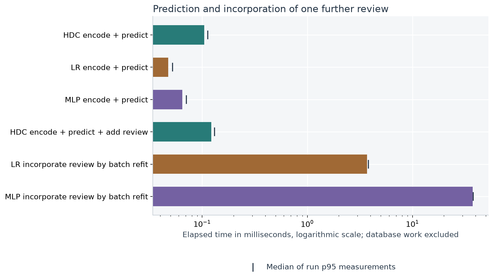

# Hyperdimensional Computing for Telecom Incident Triage

*An experimental study of composable representations, retrieval with provenance, and incremental learning*

## The operational problem

Telecom service assurance concerns the quality of the calls and data sessions customers use. When service degrades, an operations team needs to decide where to investigate first and how widely the problem may extend. A symptom affecting one subscriber might involve the phone's radio connection; similar symptoms across several subscribers might involve a shared network dependency. This first assessment is **incident triage**. It guides investigation before a cause is confirmed.

The evidence spans several kinds of data: subscriber and handset records, measurements over time, network telemetry, locations, and the relationships between network components. A useful comparison must connect those records. The same measurement can mean different things depending on which component produced it, which other components depend on it, and whether service is worsening or recovering.

Earlier incidents offer a practical starting point. A triage tool can bring comparable cases to an engineer's attention, show the observations and network facts supporting the comparison, and incorporate the outcomes of reviewed cases into future decisions. This creates a combined data-engineering and learning problem: preserve the meaning of connected, changing evidence while maintaining a memory that can grow as reviews arrive.

## Scope and research questions

We narrow that broader use case to one question:

> A commuter's call drops. Which earlier incidents resemble it, what network facts support that comparison, and how can reviewed incidents improve future triage?

The study evaluates two tasks: retrieving comparable earlier incidents, and assigning a triage pattern using previously reviewed examples. Each incident includes a short sequence of phone measurements and the network context connected to that phone at those times. Triage happens after the full observation window, so the available evidence can include deterioration or recovery.

**Hyperdimensional computing (HDC)** represents these facts in long numeric arrays called hypervectors. Its operations can attach a value to a role, combine contributions, and preserve order. We study whether an episode built with those operations can support retrieval, inspection of its source evidence, and learning through additions to labelled class memory while the encoder stays fixed.

The experiments examine four questions:

- **Representation:** Do roles, event order and network connectivity change the meaning of an encoded incident?
- **Retrieval and evidence:** Can it find comparable earlier incidents and return the source records supporting the comparison?
- **Learning:** How useful does class memory become as reviewed examples arrive, and when do updates help or hurt?
- **Resources:** What do encoding, prediction, learning updates, retrieval and storage cost, including the cost per new review?

The learning comparison evaluates HDC against regularized logistic regression and a small MLP. All three learners receive the same reviewed incidents and connected measurements. Retrieval evaluates HDC itself, with order and connectivity ablations as internal representation checks. These checks are not additional comparison models.

## The dataset

We use a controlled simulation with a recognizable geographic setting: a commute corridor along Bloor Street West in Toronto. Public street geometry supplies the map. Every subscriber, handset, trajectory, network component, measurement and review is simulated. This lets us vary roles, chronology and connectivity deliberately, and check results against retained source records. It does not establish performance on a carrier's operational data.

### Just enough telecom to read the example

A **subscriber** is the simulated customer; a **handset** is their phone. **Radio** means the wireless part of its connection. The **serving cell** provides that phone's cellular connection at the observation time, through base-station equipment. A **backhaul link** carries traffic from the cell into the rest of the operator's network. The simplified path is **phone → serving cell → backhaul link**. Other phones can use different cells but share that link; we call them **peer phones**. This [radio/transport distinction](https://www.ericsson.com/en/public-policy-and-government-affairs/5-key-facts-about-5g-radio-access-networks) is what makes connected evidence useful.

| Measurement | What it tells us |
|---|---|
| Received signal strength, in dBm | How much cellular signal power reaches the phone. **−80 dBm is stronger than −90 dBm.** |
| Cell load, in % | How busy the serving cell is; a simulated utilization indicator in this study. |
| Packet loss, in % | The share of data packets that fail to arrive. A packet is a small chunk of transmitted data; 1% loss means about one in 100 is missing. |
| Latency, in ms | How long data takes to travel over the link. One millisecond is 0.001 seconds. |
| Peer averages | Mean signal-strength and loss measurements from phones sharing the same backhaul link at the same time. |

**dBm** expresses power on a logarithmic scale relative to one milliwatt. Negative values mean power below that reference, not negative power. A 10 dB decrease means ten times less power. We simulate a generic received-power measurement; signal strength alone does not determine call quality. [Unit reference](https://scdn.rohde-schwarz.com/ur/pws/dl_downloads/dl_application/application_notes/1sl378/1SL378_0e_ColdSrcNF.pdf).

### The connected records

[Open the schema at full size](figures/schema.svg) or [in a browser](figures/schema.html). Circles are nodes; directed arrows are relationships reconstructed from record IDs. The property values are illustrative. The phone → cell relationship comes from its observation at time $t$; cell → link edges are valid when $t_0 ≤ t < t_1$. Cell load and link measurements marked **(t)** are joined telemetry at that time, rather than static component properties. Peer observations are separate source records; they need not identify individual peer subscribers.

Each simulated network/time block contains six cells and two backhaul links with one consistent **telemetry** timeline: measurements describing their state over time. Phones using the same component at the same time see the same infrastructure state. The cell-to-link edges change halfway through the block, with recorded validity intervals. Subscriber identities connect records; they do not determine similarity.

The unit of analysis is an **episode**: three observations at 0, 20 and 40 seconds, before, during and after a disruption or a normal-service reference window. Four balanced patterns define the evaluation classes:

| Pattern | What the observations show |
|---|---|
| Deteriorating radio | The phone's received signal becomes weaker across the episode. |
| Transient recovery | The phone's received signal improves by the end of the episode. |
| Shared transport impairment | The shared backhaul link and peer phones show packet loss; the phone's own signal profile can vary. |
| Normal service | Neither a large signal change nor the shared backhaul impairment occurs. |

An independent checker reconstructs these labels from source measurements, event order and valid edges. Encoder input does not include generator scenario names, labels or service-disruption outcomes. Review labels become available 300 seconds after the complete episode; they stand in for analyst feedback in the demonstration. No human reviews were collected.

Each data seed produces 2,400 episodes across 24 independent network/time blocks. Of those blocks, 12 build labelled memory, 6 support model selection, and 6 are reserved for final testing. Subscribers and shared incidents stay within their assigned block. No validation or final-test label updates memory.

The full experiment crosses 5 data seeds with 3 encoder seeds. It scores 9,000 final queries across repetitions, representing 30 distinct final-test worlds. Repeated encoders reuse episodes and are averaged before uncertainty intervals resample data seeds and complete worlds. Those intervals describe this generator.

The street snapshot contains 99 Bloor Street segments, with frozen source checksums and longitude/latitude coordinates (EPSG:4326). No distances are computed from angular coordinates, and the simulation does not predict signal strength from the street geometry. Contains information licensed under the Open Government Licence – Toronto. [Dataset](https://ckan0.cf.opendata.inter.prod-toronto.ca/en/dataset/toronto-centreline-tcl); [licence](https://www.toronto.ca/city-government/data-research-maps/open-data/open-data-licence/).

## Start with one incident

Consider a simulated commuter travelling along Bloor Street West. In this walkthrough, the phone's received signal strength changes from -80.6 dBm before the disruption to -110.6 dBm afterwards. More negative dBm values indicate weaker received signal strength. At the middle observation, the connected backhaul link reports 0.9% packet loss, and peer phones using that dependency report 1.0% mean loss.

These facts make the comparison specific: look for an earlier episode with a similar signal-strength trajectory and connected network conditions. Exact spatial and time filters first identify eligible earlier memory episodes. Similarity then ranks them, and retained observations, telemetry and valid edges let the engineer inspect what the retrieved episode has in common.

The query is **S1006-W18-E00-0**, whose independently reconstructed pattern is **deteriorating radio**. Its first retrieved comparison is **S1006-W08-E09-3**, labelled **deteriorating radio**. The walkthrough uses the first final-test episode with an observed service disruption, selected before inspecting retrieval correctness. It illustrates the workflow; the experiments below evaluate all final-test queries.

A retrieved comparison is evidence for further inspection. The triage labels describe the observed patterns in this simulation; they do not confirm the cause of the commuter's dropped call. The next section shows how the phone and network facts become one composable representation, before we measure retrieval and learning performance.

## How the encoder is built

The encoder turns an episode into one **4,096-dimensional hypervector**. Think of it as an additive description: a measurement contributes according to what it measures, where it sits in the dependency path, and when it occurs. The result retains those distinctions while supporting a single similarity comparison.

### 1. Resolve the facts before encoding

At each of three observations, exact temporal joins follow the phone's serving cell and that cell's valid backhaul edge. They supply six numeric facts. The table names the source of each fact so that “context” means a specific network relationship:

| Source at the observation time | Measurement | Physical range used for encoding |
|---|---|---|
| The commuter's phone | Received cellular signal strength | −125 to −65 dBm |
| The cell serving that phone | Cell load | 0–100% |
| The backhaul link used by that cell | Packet loss | 0–10% |
| The same backhaul link | Latency | 0–120 ms |
| Peer phones sharing that backhaul link | Mean received signal strength | −125 to −65 dBm |
| The same peer phones | Mean packet loss | 0–10% |

The **phone signal channel** contains the commuter phone's own signal measurement. The **connected-context channel** contains the other five measurements: cell load, backhaul loss and latency, and the two peer averages, all joined through the active dependency at the same time. Three observation times produce three phone signal facts and fifteen context facts per episode. The phone's handset model is a separate, small categorical contribution.

The graph chooses which source measurements enter the representation. The encoder binds **typed roles**, such as phone → serving cell → backhaul; it does not bind subscriber, cell or link identifiers. Two unrelated subscribers can therefore resemble each other when their measurements and connected context match. Changing an edge can change the joined facts even when the full network contains the same measurements.

### 2. Make nearby numbers similar

For a measurement $x$ with physical range $[a_f,b_f]$, first map it to a clipped fraction, then to one of 32 numeric levels:

$$
s_f(x)=\operatorname{clip}\!\left(\frac{x-a_f}{b_f-a_f},0,1\right),
\qquad q_f(x)=\operatorname{round}\!\left((K-1)s_f(x)\right).
$$

TorchHD supplies a seeded family of correlated level hypervectors $\ell_0,\ldots,\ell_{K-1}$. Adjacent levels overlap more than distant levels. For example, −90 and −92 dBm receive nearby representations, while −90 and −115 receive more distinct ones. The ranges are fixed physical bounds, not statistics fitted to validation or test data. Values outside them are clipped; rounding introduces finite numeric resolution.

The same level family serves every numeric field. Binding each value to its attribute role distinguishes radio strength from packet loss, even if their scaled fractions coincide.

### 3. Bind the value to its meaning and connected role

We use $\otimes$ for **binding**, $\oplus$ for **bundling**, and $\rho$ for **permutation**. Here binding multiplies corresponding coordinates, bundling adds corresponding coordinates without thresholding, and $\rho^j(v)$ rotates the coordinates of $v$ by $j$ positions. The repeated-bundling symbol $\bigoplus$ combines several hypervectors. Atomic roles and channel markers are seeded bipolar arrays containing +1 and −1.

For the commuter phone's signal strength, the role product is:

$$
P_{\mathrm{radio}}=r_{\mathrm{phone}}\otimes r_{\mathrm{radio}}.
$$

For packet loss on the connected link, it includes the ordered dependency roles:

$$
P_{\mathrm{loss}}=
r_{\mathrm{phone}}
\otimes\rho^1\!\left(r_{\mathrm{serves}}\right)
\otimes\rho^2\!\left(r_{\mathrm{cell}}\right)
\otimes\rho^3\!\left(r_{\mathrm{uses}}\right)
\otimes\rho^4\!\left(r_{\mathrm{backhaul}}\right)
\otimes\rho^4\!\left(r_{\mathrm{loss}}\right).
$$

The rotations mark positions along the typed path. Peer facts extend it with shared-dependency and peer-phone roles. This role product specifies the meaning of the joined measurement; source identities remain in the accompanying manifest for provenance.

### 4. Preserve observation order, then bundle the channels

For observation position $p\in\{0,1,2\}$ and field $f$, the unweighted contribution is:

$$
e_{p,f}=\rho^{p+1}\!\left(c_{\mathrm{channel}(f)}\otimes P_f\otimes\ell_{q_f(x_{p,f})}\right).
$$

The outer rotation marks **before, during or after**. It is separate from the rotations marking path roles. Moving a radio measurement from before the disruption to after it changes its contribution, allowing deterioration and recovery to remain distinguishable.

Bundling adds these contributions. Define the phone signal channel $S$ and context channel $C$ as:

$$
S=\frac{1}{\sqrt{3}}\bigoplus_{p=0}^{2}e_{p,\mathrm{radio}},
\qquad
C=\frac{1}{\sqrt{15}}\bigoplus_{p=0}^{2}\bigoplus_{f\in\mathcal F_C}e_{p,f}.
$$

The square-root divisors account for the different numbers of terms; they do not force every episode's channel norm to be equal. If $H$ is the handset-category hypervector bound to its attribute and channel roles, the raw episode accumulator is:

$$
z=(w_S S)\oplus(w_C C)\oplus(w_H H),
\qquad (w_S,w_C,w_H)=(1.0,2.0,0.25).
$$

**“Context weight” means $w_C$, the multiplier of the bundled connected-context channel $C$ before normalization.** Context here consists of the five graph-joined network and peer measurements in the table, at each of three times; it does not mean location, subscriber identity or free text. With the active defaults, the complete equation is:

$$
z=\frac{1}{\sqrt{3}}\bigoplus_{p=0}^{2}e_{p,\mathrm{radio}}
 \oplus\frac{2}{\sqrt{15}}\bigoplus_{p=0}^{2}\bigoplus_{f\in\mathcal F_C}e_{p,f}
 \oplus0.25H.
$$

Each radio fact therefore has raw coefficient $1/\sqrt{3}\approx0.577$, while each network-context fact has $2/\sqrt{15}\approx0.516$. The channel multiplier is two, but each context fact does not receive twice the coefficient of a radio fact: the channel contains more terms. The experiment configuration and stored term manifests record these coefficients explicitly.

**Why give connected context more weight?** A shared transport incident can accompany weak, recovering or normal phone radio. Its common evidence lies upstream. Weight 2.0 was chosen in the earlier validation diagnosis and frozen before this fresh evaluation. It keeps the network evidence from being overwhelmed by the varying radio profile. It is a modelling choice for this study, not a universal HDC constant.

These are weights on raw contributions. Doubling a channel multiplies its direct contribution to a pairwise dot product by four before normalization; cross terms and normalization also affect the final score. It does not reserve a fixed percentage of similarity for that channel.

### 5. Use the same accumulator for retrieval, editing and learning

All arithmetic above uses float32 and retains the unthresholded bundle. Only then normalize:

$$
\hat z=\frac{z}{\lVert z\rVert_2},
\qquad \operatorname{similarity}(q,x)=\hat z_q^\mathsf{T}\hat z_x.
$$

Retrieval first applies exact spatial/time eligibility, then ranks eligible earlier episodes by similarity. Search storage uses float16; computation returns to float32 and the stored-vector residual is checked separately.

Because the raw bundle is retained, removing the handset means $z'=z\oplus(-w_HH)$, followed by normalization. Subtracting a component from an already normalized vector would be a different operation. The acceptance checks compare this edit with a complete rebuild.

A reviewed incident labelled $y$ updates a class accumulator by addition:

$$
A_y\leftarrow A_y\oplus\hat z,
\qquad \operatorname{score}_y(q)=\hat z_q^\mathsf{T}\frac{A_y}{\lVert A_y\rVert_2}.
$$

This is an **additive cosine class-memory classifier**: one accumulator per class, containing the sum of normalized hypervectors from that class's reviewed incidents. Prediction chooses the available class whose normalized accumulator has the highest cosine similarity to the query. The class representative is sometimes called a prototype; it is specifically this accumulated vector, not a separate feature model or neural network. The encoder stays fixed while labelled memory grows. Unseen classes are excluded from prediction; before any reviews, the system reports insufficient labelled memory. Updates retain an audit record and support exact reversal.

For an inspected candidate with weighted terms $t_j$, the retained manifest also permits exact arithmetic attribution:

$$
z_x=\bigoplus_{j=1}^{m} t_j,
\qquad a_j=\frac{\hat z_q^\mathsf{T}t_j}{\lVert z_x\rVert_2},
\qquad \operatorname{similarity}(q,x)=a_1+\cdots+a_m.
$$

The $t_j$ are hypervector contributions, combined by bundling; each $a_j$ is a scalar contribution to the cosine score. Each contribution links back to source observations, telemetry and valid edges. These contributions explain how the numeric score was assembled, including interference between terms. They do not establish the cause of a dropped call: the source records provide provenance, while similarity proposes comparisons.

## Experiment 1: what do the operators preserve?

**Question.** Can the representation distinguish the same values attached to different meanings, appearing in different orders, or connected through different edges?

**Setup.** Binding attaches a value to a role. Bundling adds contributions. Permutation marks an observation's place in the episode. The phone signal channel has weight 1; connected cell/link/peer context has weight 2. Numeric levels preserve neighbourhoods; the handset contribution has weight 0.25. The dimension is 4,096.

Hyperdimensional computing (HDC) represents information in long numeric arrays called hypervectors. Here, each atomic role starts as a seeded array of +1 and −1 values. Distinct roles have little overlap, while nearby numeric measurements deliberately receive correlated arrays. An episode becomes a sum of these encoded contributions rather than an opaque identifier.

In this implementation, binding multiplies arrays element by element, bundling adds them, and permutation rotates their coordinates by a fixed number of positions. Binding gives radio strength a different meaning from link loss. A position-specific rotation distinguishes the same observations in reverse order. The connected channel follows the time-valid phone → cell → backhaul dependency before encoding its measurements and peer context.

The operator vocabulary is small: `bind(role, value)` keeps a measurement attached to its meaning; `bundle(facts)` combines contributions; `permute(observation, position)` marks order. Learning reuses addition: `class_memory += normalize(episode_vector)`. The encoder implements these operations with TorchHD; no text embedding model is needed for these tabular records.

**Result.** Swapping good/bad states between phone radio and an upstream link gives cosine 0.039. Omitting binding makes the two accumulators equal within 0. Reversing the observations gives cosine 0.901; omitting order leaves error 9.5e-07. Rewiring one serving edge gives cosine 0.942; pooling the same network measurements without their connections leaves error 0. The adjacent numeric-level cosine is 0.962, compared with 0.018 for distant levels.

**Interpretation.** These controlled illustrations show exactly what the operators do. The graph pair retains every measured value and changes one edge in a separate counterfactual world. Its two-candidate ranking has a 50% random reference and serves as an illustration, not a practical graph benchmark. Broader retrieval usefulness is measured next.

The handset contribution can be removed from a raw query without re-encoding the other facts. Reconstruction error in the walkthrough is 1.2e-07. The original top five are `S1006-W08-E09-3, S1006-W11-E21-3, S1006-W10-E12-0, S1006-W03-E07-1, S1006-W03-E23-0`; after removing handset they are `S1006-W08-E09-3, S1006-W00-E09-2, S1006-W11-E21-3, S1006-W08-E22-1, S1006-W10-E12-0`. A changed ranking is an editable query, not automatically a better result.

## Experiment 2: can it retrieve useful earlier incidents?

**Question.** Does the representation return earlier incidents with the same independently checked triage pattern, and can their source evidence be inspected?

**Setup.** Every query uses an exact corridor/time filter and a memory-only candidate set. All three observations must qualify. Lance and independently registered GeoDataFusion agree on selected observation identities. The first run has 79–420 candidates per query (mean 319.3). Relevance means the same triage pattern, not the same real-world cause. Connectivity and order are removed separately in HDC ablations to check their contribution to retrieval.

| Method | Precision@5, 95% interval | Top-1 match | Reciprocal rank@10 |
|---|---:|---:|---:|
| HDC | 96.3% [95.7%, 96.7%] | 98.5% | 0.991 |
| HDC: connectivity omitted | 60.6% [59.6%, 61.5%] | 62.5% | 0.763 |
| HDC: order omitted | 70.0% [68.7%, 71.1%] | 73.3% | 0.836 |
| HDC in Lance (float16) | 96.3% [95.7%, 96.7%] | 98.5% | 0.991 |

Random ranking yields expected precision 25.0%, based on each query's eligible label prevalence. The paired HDC difference when connectivity is omitted is 35.7 percentage points [34.6, 36.8]. When order is omitted, the difference is 26.2 points [25.3, 27.4].

**Evidence.** Every stored-vector top hit was checked against its source records. Maximum raw reconstruction error across runs is 0; maximum float32 reference-score reconstruction error is 9.8e-08. Reference scores are decomposed into additive term contributions under the raw accumulator's normalization. A separately recorded quantization residual connects that reference to the stored float16 vector's cosine. These contributions include cross-term interference; they are not causal importance scores. Source identities and timestamps support each term.

**Errors.** The first fixed run has 5 top-1 mismatches out of 600. Examples are retained rather than discarded:

| Query | Expected pattern | Retrieved pattern |
|---|---|---|
| S1006-W18-E06-1 | shared transport impairment | transient disruption and recovery |
| S1006-W18-E24-2 | shared transport impairment | normal service |
| S1006-W21-E02-2 | shared transport impairment | deteriorating radio |
| S1006-W22-E14-0 | shared transport impairment | normal service |
| S1006-W22-E17-3 | normal service | transient disruption and recovery |

**Interpretation.** The HDC ablations reveal the value of retaining order and connected context. This retrieval experiment does not establish an advantage over LR or MLP, which are evaluated as classifiers in Experiment 3. Float16 search storage is independently verified against its quantized vectors; its mean precision difference from float32 is 0.000 points. Float32 accumulators remain authoritative for arithmetic and updates.

## Experiment 3: how does memory grow through reviews?

**Question.** How useful is class memory with few labelled incidents, and what happens when feedback arrives after a decision?

**Setup.** Each class starts with no vector. Encoding produces an episode hypervector; a review adds its normalized vector to the appropriate float32 class accumulator. Prediction compares the episode with normalized class memories. The comparison models are regularized multinomial logistic regression and a small one-hidden-layer ReLU MLP. Both receive the same 21 input features: six measurements at each of three ordered observations, plus three handset-category indicators. The connected measurements come from the same valid graph joins as HDC. Validation chooses between the already declared physical range scaling and an additional StandardScaler fitted only to the reviewed memory examples at each budget. Both models use L-BFGS optimization to a declared tolerance; they are not limited to one training pass. LR regularization and MLP width/regularization are selected separately at each budget using the first data seed's validation worlds, averaged across three initialization seeds, then frozen for every final test. Every method receives the same reviewed incidents. Review budgets count training labels; additional labelled validation worlds support model selection.

| Reviews per class | HDC macro F1 | Trained LR macro F1 | Small MLP macro F1 |
|---:|---:|---:|---:|
| 1 | 82.3% [78.4%, 85.5%] | 74.9% [70.6%, 79.2%] | 73.4% [69.7%, 77.0%] |
| 2 | 91.0% [88.6%, 93.5%] | 84.7% [78.0%, 89.4%] | 85.2% [83.2%, 87.1%] |
| 5 | 96.5% [95.1%, 97.6%] | 94.8% [93.0%, 96.3%] | 96.3% [94.7%, 97.8%] |
| 10 | 98.5% [97.7%, 99.3%] | 96.5% [95.1%, 97.6%] | 98.3% [97.6%, 99.1%] |
| 20 | 98.7% [98.2%, 99.1%] | 98.3% [97.7%, 98.9%] | 99.1% [98.4%, 99.7%] |

**Result.** More reviews improve the aggregate result over the one-example starting point. HDC reaches mean macro F1 ≥0.80 with 1 review per class (4 total). The curve can plateau or regress at intermediate budgets; more reviews do not guarantee improvement. Macro F1 gives each pattern equal weight, with 1.0 representing perfect classification. The first delayed-feedback replay's HDC accuracy is 96.7%, with prediction coverage 99.0%. Coverage includes initial decisions for which no review has arrived; these produce “insufficient labelled memory”. This replay uses memory-building episodes, while the learning curves above use independent final-test worlds.

At 5 reviews per class, the paired, world-grouped differences are HDC minus LR: 1.6 percentage points [-0.6, 3.7]; HDC minus MLP: 0.2 percentage points [-1.4, 2.1]. There are 3 convergence warnings among the 150 final LR/MLP fits, and 2 among 210 validation-selection fits. Diagnostics and iteration counts are retained for every fit.

The aggregate score can hide a difficult pattern. At 5 reviews per class, the following share of final-test examples is assigned to the wrong class, averaged across the seed grid. These are descriptive per-class errors; the grouped uncertainty intervals above apply to macro F1. Detailed confusion matrices are retained for every budget and world.

| Actual pattern | HDC error rate | Trained LR error rate | Small MLP error rate |
|---|---:|---:|---:|
| Deteriorating radio | 0.0% | 0.1% | 0.1% |
| Transient disruption and recovery | 0.2% | 0.4% | 0.5% |
| Shared transport impairment | 11.8% | 6.9% | 7.6% |
| Normal service | 1.9% | 12.9% | 6.5% |

Updates are not guaranteed to help. The first fixed replay contains these examples:

- **Helps:** S1006-W00-E00-0: 5 corrected, 0 regressed, 20 predictions changed.
- **Hurts:** S1006-W00-E02-3: 0 corrected, 1 regressed, 1 prediction changed.
- **Unchanged:** S1006-W00-E01-0: 0 corrected, 0 regressed, 0 predictions changed.

These examples use a fixed diagnostic probe within the memory partition, including episodes that are later reviewed. They are neither held-out performance estimates nor a signal for choosing updates. All updates follow the configured review schedule. The full log records review provenance, availability time, encoder hash, update-vector hash and before/after accumulator hashes. Exact reversal restores the previous float32 snapshot rather than relying on rounded subtraction.

**Interpretation.** There is supervised learning, but no encoder retraining or optimization loop for the HDC memory. Adding unlabelled records to a retrieval store is a different operation. The learning curves determine how strongly we can describe sample efficiency on these patterns; they do not establish it across telecom tasks.

## Experiment 4: how cheap is the complete operation?

**Question.** What does it cost to encode an episode, score it and update memory, and how much storage is used?

**Setup.** One Torch/BLAS CPU thread; batch one; 50 warm-up iterations and 500 measurements for prediction/addition per seed pair. More expensive classifier refits use 2 warm-ups and 7 measurements. The table reports the median of run medians and the median of run p95 measurements. The runtime is macOS-26.6.2-arm64-arm-64bit, Python 3.12.13. Joins, geo selection and database writes are separate from these warm compute measurements.

| Operation | Median of run medians | Median of run p95 |
|---|---:|---:|
| HDC addition only | 0.0005 ms | 0.0005 ms |
| HDC encoding | 0.0859 ms | 0.0936 ms |
| HDC scoring | 0.0170 ms | 0.0175 ms |
| HDC encode–predict | 0.1049 ms | 0.1129 ms |
| LR encode–predict | 0.0474 ms | 0.0523 ms |
| MLP encode–predict | 0.0646 ms | 0.0706 ms |
| HDC encode–score–update | 0.1223 ms | 0.1311 ms |
| LR encode–refit–predict | 3.7061 ms | 3.7999 ms |
| MLP encode–refit–predict | 37.3624 ms | 37.7802 ms |

HDC's raw accumulator uses 16,384 bytes per episode; its search vector uses 8,192 bytes in float16. The LR/MLP input vector uses 84 bytes in float32. Four HDC class accumulators use 65,536 bytes, before mappings, counters, audit history and exact-undo snapshots. These sizes describe representations, not the complete trained models. This dataset supports no compression claim.

Measured resource totals in the first fixed run:

| Resource | Size |
|---|---:|
| All float32 HDC episode tensors | 37.50 MiB |
| All LR/MLP input tensors | 0.19 MiB |
| Cached encoder basis tensors | 11.92 MiB |
| Lance vector store, raw/search vectors and manifests | 62.61 MiB |
| Lance source-record store | 3.16 MiB |

LR and MLP trained estimators, including any fitted scalers, are saved and checked for identical predictions after reloading. Their serialized sizes and initial fit times are recorded separately at every review budget.

At 20 reviews per class, median serialized estimator size is 1,328 bytes for LR and 17,401 bytes for MLP. These include estimator metadata and any fitted scaling, but exclude the retained review buffer. That buffer uses 7,452 bytes for the refit measurement. HDC's class tensor size also excludes audit history and encoder basis tensors.

Observed median initial fit times across the seed grid, excluding encoding and persistence:

| Reviews per class | HDC memory building, ms | LR fitting, ms | MLP fitting, ms |
|---|---:|---:|---:|
| 1 | 0.14 | 2.08 | 10.45 |
| 2 | 0.16 | 1.36 | 8.48 |
| 5 | 0.35 | 2.39 | 30.25 |
| 10 | 0.67 | 2.95 | 40.52 |
| 20 | 1.32 | 3.58 | 38.09 |

These initial fits are recorded once per run and budget; the repeated refit benchmark above supplies a separate measurement of incorporating a further review. Model-selection compute is recorded in the frozen settings and is not included in these initial fits.

The directory totals include retained Lance versions and metadata. They describe these artifacts rather than an optimized storage comparison. Tensor totals exclude Python objects, source tables, temporary allocations and audit history; peak process memory was not measured.

The first run encodes all episodes in 0.265 s, persists the vectors and manifests in 0.459 s, and performs all validation/test geography gates plus independent checks in 11.696 s. LanceDB retrieval median is 6.139 ms; the matched in-memory HDC scoring-and-ranking median is 0.425 ms. They measure different layers and are not an implementation speed contest.

**Interpretation.** The addition is cheap. For LR and MLP, review incorporation here means encoding the new incident, refitting on 81 retained reviewed examples, then predicting it. HDC encodes, predicts with its existing class memory, and adds the new review. Those are different update strategies. Conventional incremental optimizers and warm starts could reduce refit cost; they are not evaluated here, so this comparison supports no general claim that conventional ML must retrain from scratch. The complete operation and alternative methods deserve equal attention. These are component measurements on one machine, without energy, production serving, spatial-index or ANN benchmarks. Near-real-time suitability requires an application latency budget and its complete data path.

### Next evaluation: per-sample incremental learning versus batch retraining

**Question.** Starting from the same reviewed history, how much compute and latency does each method need to incorporate newly reviewed incidents? This requested follow-up is now a completed experiment.

**Setup.** Each measurement starts with 80 reviewed incidents (20 per class), using the same review IDs across methods. Batches contain 1, 20, 40 chronologically later memory-partition reviews. For each batch, every method encodes the new incidents, incorporates their labels, then predicts that batch with the updated memory or model. Final-test and validation reviews do not participate.

HDC normalizes each new hypervector and adds it to the labelled class accumulator; it does not revisit earlier incidents or optimize an encoder. LR and the MLP reuse the retained earlier feature vectors and perform **one full L-BFGS refit per arriving batch**, on the initial reviews plus that batch, with the already frozen regularization and model settings. Twenty new reviews therefore mean one refit on 100 reviews, rather than twenty separate refits; forty mean one refit on 120.

Each repetition resets to the same starting state. Initial fitting and HDC state restoration occur outside the timer. All methods use one Torch/BLAS CPU thread, 2 warm-up repetitions and 7 measured repetitions per batch and seed pair, with a warm encoder cache. The measurements include feature/vector encoding, learning, and prediction; joins, geographic eligibility, audit persistence and database work remain separate. Every requested batch size was measured.

For $B$ new reviews and $N$ previously reviewed incidents, the measured operations are:

$$
T_{\mathrm{HDC}}(B)=T_{\mathrm{encode}}(B)+T_{\mathrm{normalize+add}}(B)+T_{\mathrm{predict}}(B),
$$

$$
T_{\mathrm{LR/MLP}}(N,B)=T_{\mathrm{encode}}(B)+T_{\mathrm{refit}}(N+B)+T_{\mathrm{predict}}(B),
\qquad t_{\mathrm{per\ new\ review}}=\frac{T(N,B)}{B}.
$$

The per-review number for LR/MLP is **amortized batch cost**. It is not the time to update immediately when each sample arrives; collecting a batch introduces a waiting time that this compute benchmark does not measure. For HDC, the same additions can be applied one review at a time without waiting for a batch. The delayed-feedback experiment demonstrates that separate behaviour.

**Result.** Total wall latency and amortized cost per new review, reported as the median of seed-pair medians. The p95 column is the median of seed-pair p95 measurements; it is descriptive timing variation, not an independent-world confidence interval. Process CPU time measures CPU work during the complete operation alongside elapsed wall time.

| New reviews | Learning method | Reviews after update | Total wall, ms | Wall p95, ms | Wall per new review, ms | CPU per new review, ms |
|---:|---|---:|---:|---:|---:|---:|
| 1 | HDC additive class memory | 81 | 0.132 | 0.139 | 0.1325 | 0.1340 |
| 1 | LR full batch refit | 81 | 3.668 | 3.762 | 3.6685 | 3.6690 |
| 1 | MLP full batch refit | 81 | 36.324 | 37.331 | 36.3242 | 36.3080 |
| 20 | HDC additive class memory | 100 | 2.455 | 2.556 | 0.1228 | 0.1228 |
| 20 | LR full batch refit | 100 | 3.700 | 3.839 | 0.1850 | 0.1850 |
| 20 | MLP full batch refit | 100 | 38.151 | 38.930 | 1.9075 | 1.9058 |
| 40 | HDC additive class memory | 120 | 4.853 | 4.994 | 0.1213 | 0.1212 |
| 40 | LR full batch refit | 120 | 3.738 | 3.851 | 0.0935 | 0.0932 |
| 40 | MLP full batch refit | 120 | 47.060 | 47.646 | 1.1765 | 1.1753 |

The corresponding stage costs per new review are:

| New reviews | Learning method | Encoding, ms | Addition or refit, ms | Prediction, ms |
|---:|---|---:|---:|---:|
| 1 | HDC additive class memory | 0.0928 | 0.0186 | 0.0202 |
| 1 | LR full batch refit | 0.0092 | 3.5942 | 0.0635 |
| 1 | MLP full batch refit | 0.0144 | 36.0902 | 0.1020 |
| 20 | HDC additive class memory | 0.0883 | 0.0162 | 0.0177 |
| 20 | LR full batch refit | 0.0045 | 0.1773 | 0.0034 |
| 20 | MLP full batch refit | 0.0049 | 1.8968 | 0.0062 |
| 40 | HDC additive class memory | 0.0879 | 0.0160 | 0.0175 |
| 40 | LR full batch refit | 0.0043 | 0.0872 | 0.0017 |
| 40 | MLP full batch refit | 0.0047 | 1.1662 | 0.0035 |

At 40 new reviews, complete amortized wall cost is 0.1213 ms per review for HDC, 0.0935 ms for LR, and 1.1765 ms for the MLP. LR is cheaper per new review than HDC at this batch size. The batch size changes the practical cost comparison; a one-review refit cost should not be extrapolated by multiplying it by the number of arriving reviews.

Stage medians need not sum exactly to the median complete-operation latency. Raw repeated measurements and fit diagnostics are retained under `resources.learning_updates` in every pair's `results.json`. Timed HDC updates must exactly match a complete reconstruction from the initial and newly reviewed hypervectors; those checks occur outside the timer. There are 7 convergence-warning refits among the measured batch repetitions; diagnostics are retained rather than silently discarded.

**Interpretation.** This compares additive HDC class-memory updates with these implementations' full batch retraining strategy, including the cost of encoding new incidents. It does not benchmark incremental SGD, warm starts, cached encoder-free updates, energy or a production pipeline. HDC's update work depends on the incoming hypervectors and fixed class memory, while a batch refit consumes the growing retained review set. Because the initial history is fixed at 80 reviews, the experiment measures the requested batch costs; it does not establish a scaling law over arbitrarily large training histories.

## What this supports

| Claim | Evidence | Boundary |
|---|---|---|
| Composable representation | Role swaps, order changes and edge rewiring are detectable; controls without the relevant operator remain invariant. | Controlled illustrations and ablations support the designed representation, not arbitrary graph reasoning. |
| Inspectable evidence | All 9,000 retrieved top hits resolve to source records and reconstruct their float32 reference scores. | Provenance is retained alongside vectors; arithmetic contributions include interference and do not establish causes. Float16 search has a separately recorded quantization residual. |
| Online learning | Frozen encoder, delayed reviews, additive class memories, exact reversal; HDC reaches mean macro F1 ≥0.80 with 1 review per class (4 total). | Supervised learning still requires labels. Updates can regress, and the scenarios are simulated. |
| Compute cost | Addition, prediction and review incorporation are measured separately on CPU against trained LR and MLP. | Fast addition alone is not serving latency, energy efficiency, or an advantage over the measured controls. |
| Storage | 16,384 bytes per raw hypervector versus 84 bytes per LR/MLP input vector. | This study shows no storage saving from HDC. |

The simulator uses simple observed rules and deliberately balanced classes, with complete telemetry. This makes the mechanisms observable and supplies a compact feature table that conventional trained classifiers can use effectively. It does not demonstrate operational diagnosis, realistic class prevalence, continual adaptation under drift, robustness to missing telemetry, or coverage across new incident types. Those would need separate experiments.

## Potential enhancements: more geographic capabilities

**This demo only scratches the surface of GeoArrow and GeoDataFusion.** GeoArrow carries observation points with coordinate-system metadata. Lance applies the geographic and time filters, and GeoDataFusion independently checks that they select the same observations. LanceDB then ranks eligible episode hypervectors by cosine distance. These are distinct operations: geographic selection determines which incidents qualify; hypervector similarity compares their represented telecom patterns.

**Lance's type system is Arrow-native.** It uses Apache Arrow types and in-memory arrays, with support for extension-type metadata. This shared foundation lets us build on compatible developments across the larger Arrow ecosystem, including GeoArrow geometry types and GeoDataFusion spatial queries. The demo already checks that GeoArrow geometry and coordinate-system metadata survive the Lance round trip. Additional operations still need integration and validation in the relevant query engine; shared types do not automatically make every operation available inside Lance. [Lance data types](https://lance.org/guide/data_types/), [Lance schema and extension types](https://lance.org/format/table/schema/)

Potential extensions include:

- **Richer geographic data with GeoArrow.** Carry road lines, service-area polygons and infrastructure locations alongside observation points, and exchange those geometries with GeoPandas or GeoParquet while preserving geometry and coordinate-system metadata. [GeoArrow documentation](https://github.com/geoarrow/geoarrow-python)
- **Spatial joins with GeoDataFusion.** Match observations to service-area polygons using containment or intersection, then count or summarize incidents by area. These queries would extend its current role as an independent filter check. [GeoDataFusion spatial relationships](https://github.com/datafusion-contrib/geodatafusion#spatial-relationships)
- **Distance-based candidate selection.** Use geometry distance to select observations near a road or infrastructure location, or to support a geographic-radius filter. GeoDataFusion supports `ST_Distance`; a metre-based query would first require geometries in an appropriate coordinate system whose units are metres. Our current longitude/latitude geometry calculations use angular units. [GeoDataFusion measurement functions](https://github.com/datafusion-contrib/geodatafusion#measurement-functions)

For example, a future query could **find incidents within 500 metres of a location, apply the time and earlier-memory filters, then rank their hypervectors by similarity in LanceDB**. That would extend candidate selection while reusing the existing encoder and prototype learner. Geography could remain outside the hypervector; adding geographic features to the encoding would be a separate modelling choice.

## Takeaways

In this controlled study, HDC combines role-sensitive, ordered representations with connected network evidence. Retrieval returns comparable earlier incidents with source records that can be inspected, and reviewed examples improve class memory through reversible additions while the encoder stays fixed.

HDC performs well with few reviewed examples. Its advantage is clearest at the smallest label budgets; LR and the MLP become competitive as more reviews arrive. The results support composable representation and incremental memory building, with usefulness measured against familiar trained classifiers.

The resource comparison depends on the update strategy and batch size. HDC incorporates individual reviews quickly, while LR batch retraining amortizes well and is cheaper per review at the largest measured batch. HDC uses more representation storage than the LR/MLP input vector. These findings apply to the simulated patterns and measured CPU workload; operational telemetry, missing data and drift remain untested.

## Reproduce and inspect

Inspect the [source code](../../src/) for the implementation. Run `uv run src/prepare.py`, `uv run src/run.py`, then `uv run src/report.py` from the repository root. All three scripts use the paths in `src/settings.py`. The manifest records dependency versions, source checksums, configuration, encoder and code hashes, and all completed seed pairs. The committed metrics retain block-level results, per-class errors and repeated timing measurements. Reproducing a run generates the detailed predictions, review logs, retrieval errors, query edits and source witnesses locally. The active learning comparison uses trained LR and a small MLP.

The [LR](https://scikit-learn.org/stable/modules/generated/sklearn.linear_model.LogisticRegression.html) and [MLP](https://scikit-learn.org/stable/modules/generated/sklearn.neural_network.MLPClassifier.html) implementations come from locked scikit-learn 1.9.1. The encoder weighting was selected on separate validation worlds (data seeds 1001–1005) and frozen before this evaluation. The full study defaults now use fresh data seeds 1006–1010. These are new independent simulated worlds, not external carrier validation. The actual data seeds in this run are 1006, 1007, 1008, 1009, 1010. LR/MLP settings use only this run's first data seed's validation worlds and are frozen before final testing.

The declared search space uses LR C ∈ {0.1, 1, 10}, MLP hidden width ∈ {16, 32}, MLP alpha ∈ {0.001, 0.1}, and fixed physical range scaling or an additional training-fitted StandardScaler. C controls inverse L2 regularization strength; alpha controls MLP regularization. The HDC weighting is fixed throughout this run; no HDC variant search, additional feature engineering or test-based selection is performed. Only the active encoder is evaluated, alongside operator ablations that answer the representation questions. The frozen choices are:

| Reviews/class | LR C | LR scaling | MLP width | MLP alpha | MLP scaling |
|---|---:|---|---:|---:|---|
| 1 | 10.0 | fixed_range | 32 | 0.1 | fixed_range |
| 2 | 1.0 | fixed_range | 16 | 0.1 | fixed_range |
| 5 | 10.0 | fixed_range | 32 | 0.1 | fixed_range |
| 10 | 10.0 | fixed_range | 32 | 0.1 | fixed_range |
| 20 | 10.0 | fixed_range | 32 | 0.1 | fixed_range |
